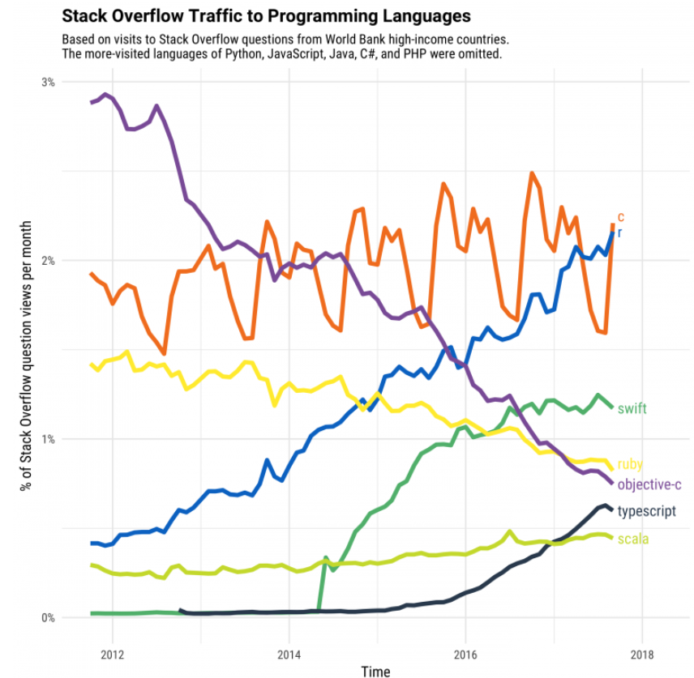

class: center, middle

.linea-superior[]
.linea-inferior[]


## Introducción a R

## Proyecto Estratégico Servicios Compartidos para la Producción Estadística

### Noviembre 2020


```{r setup, include=FALSE}
options(htmltools.dir.version = FALSE)
knitr::opts_chunk$set(message = FALSE) 
```

```{r xaringan-themer, include=FALSE, warning=FALSE}
library(xaringanthemer)
#style_duo_accent(
 # primary_color = "#1381B0",
  #secondary_color = "#FF961C",
  #inverse_header_color = "#FFFFFF"
#)
```


---
background-image: url("imagenes/fondo2.PNG")
background-size: contain;
background-position: 100% 0%

# Objetivo de la presentación

<br>
<br>

.center[
## Mostrar las principales funcionalidades de `R`
]

--

.center[

## Entregar algunas herramientas prácticas para la instalación de algunos componentes
]


---

background-image: url("imagenes/fondo2.PNG")
background-size: contain;
background-position: 100% 0%

# Contenidos de la presentación

--

- Descripción general del lenguaje

--

- Presentación del IDE

--

- Manejo de paquetes

--

- Interacción con bases de datos

--

- Aplicaciones en html

--

- Interacción con otros lenguajes (python, SQL)

--

- Funciones para chequear hardware

---
background-image: url("imagenes/fondo2.PNG")
background-size: contain;
background-position: 100% 0%

# Descripción del lenguaje

`R` es un lenguaje de libre distribución y de código abierto, disponible para *Linux, Windows y MacOS*

--

Tanto R como RStudio (IDE) son gratuitos

.pull-left[

]

.pull-right[


]


--

La primera versión de `R` es de 1993 y constantemente aparecen actualizaciones (versión actual 4.0.3) 

--

Es un lenguaje interpretado de alto nivel, que utiliza por detrás código de C, C++ y Fortran.

---
background-image: url("imagenes/fondo2.PNG")
background-size: contain;
background-position: 100% 0%

# Descripción del lenguaje

`R` fue diseñado por estadísticos y para estadísticos

--

Con el tiempo su uso se ha ido extendiendo a otras áreas: medicina, ciencia política, ingeniería, ciencias sociales, ecología, entre otros.

--

.center[


]


---

background-image: url("imagenes/fondo2.PNG")
background-size: contain;
background-position: 100% 0%

# Descripción del lenguaje


Actualmente, es un lenguaje muy popular en el mundo académico y está tomando fuerza en el sector público 


.center[


]


--

### Compite con Python en el campo de la ciencia de datos

---
background-image: url("imagenes/fondo2.PNG")
background-size: contain;
background-position: 100% 0%

# Paquetes (librerías) en R 

La comunidad de R colabora activamente en el desarrollo de paquetes

--

CRAN (*Comprehensive R Archive Network*) es el repositorio donde se almacenan los paquetes "oficiales"

--

Actualmente en CRAN hay más de 10.000 paquetes disponibles

--

Entrar a CRAN requiere cumplir con ciertos estándares de calidad

--

Muchos usuarios suben sus paquetes a github o gitlab


---

background-image: url("imagenes/fondo2.PNG")
background-size: contain;
background-position: 100% 0%

# Instalación de paquetes 

Paquetes que están en CRAN

```{r, eval=FALSE}
install.packages("tidyverse")
```

--

```{r, eval=FALSE}
library(tidyverse)
```

--

Paquetes fuera de CRAN

```{r, eval=FALSE}
library(devtools)
install_github("Klauslehmann/calidad")
```


[Ejemplo paquete en github](https://github.com/Klauslehmann/calidad)

---

background-image: url("imagenes/fondo2.PNG")
background-size: contain;
background-position: 100% 0%

# Instalación de paquetes 

Instalación de versiones anteriores de un paquete

```{r, eval=FALSE}
devtools::install_version("ggplot2", version = "0.9.1", repos = "http://cran.us.r-project.org")

```

--

Para instalar paquetes precompilados

```{r, eval=FALSE}
install.binaries("ggplot2")
```


---

background-image: url("imagenes/fondo2.PNG")
background-size: contain;
background-position: 100% 0%

# R para bases de datos 

Existen varios paquetes para trabajar con bases de datos 

- `DBI`

- `RODBC`

- `dbConnect`

- `RSQLite`

- `RMySQL`

- `RPostgreSQL`

--

Podemos consultar la base usando directamente código de SQL

--

```{r, eval=FALSE}
library(RODBC)
con <- odbcDriverConnect('driver=ODBC Driver 11 for SQL Server;server=buvmsqlwinp04\\RRAA,58550;database=SUPERINTENDENCIA_2; uid=****; pwd=*******')

query = sqlQuery(con, 'SELECT TOP 10 * FROM SUPERINTENDENCIA_2.dbo.COTIZACIONES_TRAB_A02') #<<
```


---

background-image: url("imagenes/fondo2.PNG")
background-size: contain;
background-position: 100% 0%

# R para bases de datos 

También es posible hacer consultas con código de `R`, mediante `dbplyr`

--

```{r, eval=FALSE}
library(dbplyr)
con <- DBI::dbConnect(RSQLite::SQLite(), "driver=ODBC Driver 11 for SQL Server;server=buvmsqlwinp04\\RRAA,58550;database=SUPERINTENDENCIA_2; uid=****; pwd=*******")

copy_to(con, query, "query2")
query2 <- tbl(con, "query2")

media <- query2 %>%
  group_by(anio) %>% 
  summarise(media = mean(ID_trabajor, na.rm = TRUE)) %>% 
  select(media)

media %>% 
  collect()


```


---
background-image: url("imagenes/fondo2.PNG")
background-size: contain;
background-position: 100% 0%

# R y html

Existen múltiples herramientas para generar archivos html

--

Esta presentación es un archivo html generado con un paquete llamado `rmarkdown`

--

```{html, eval = F}
<script>
slideshow._releaseMath = function(el) {
  var i, text, code, codes = el.getElementsByTagName('code');
  for (i = 0; i < codes.length;) {
    code = codes[i];
    if (code.parentNode.tagName !== 'PRE' && code.childElementCount === 0) {
      text = code.textContent;
      if (/^\\\((.|\s)+\\\)$/.test(text) || /^\\\[(.|\s)+\\\]$/.test(text) ||
          /^\$\$(.|\s)+\$\$$/.test(text) ||
          /^\\begin\{([^}]+)\}(.|\s)+\\end\{[^}]+\}$/.test(text)) {
        code.outerHTML = code.innerHTML;  // remove <code></code>
        continue;
      }
    }
    i++;
  }
};
slideshow._releaseMath(document);
</script>

```

---
background-image: url("imagenes/fondo2.PNG")
background-size: contain;
background-position: 100% 0%

# rmarkdown 

Es un paquete que está siendo utilizado de manera intensiva en la SDT para generar reportes 

--

Permite generar archivos html y pdf

--

La modalidad pdf soporta código de latex 

--

Dado que `rmarkdown` permite incluir texto plano y código en R, es ideal para incorporar sistemas automáticos de reportería 


---
background-image: url("imagenes/fondo2.PNG")
background-size: contain;
background-position: 100% 0%

# R y html 

bookdown es otro paquete para generar archivos html

--

El objetivo es generar un libro en formato digiatl

--

[R for data science](https://r4ds.had.co.nz/) 

--

El manual de trabajo de campo de la prueba piloto EPF fue generado mediante bookdown


---
background-image: url("imagenes/fondo2.PNG")
background-size: contain;
background-position: 100% 0%

# R y shiny 

`shiny` permite crear aplicaciones web mediante código de R

--

El paquete permite generar un archivo html que contiene javascript y css. 

--

Se estructura a partir de 2 funciones principales:

- ui: interfaz de usuario 

- server: procesa los datos 

[]()

---

background-image: url("imagenes/fondo2.PNG")
background-size: contain;
background-position: 100% 0%


# Aplicaciones con R 

Es posible construir aplicaciones mediante `shiny`

--

`shiny` genera de manera sencilla una aplicación que incopora html, javascript y css

--

Se estructura sobre la base de dos funciones: 

- ui: interfaz de usuario

- server: procesa la información

---

background-image: url("imagenes/fondo2.PNG")
background-size: contain;
background-position: 100% 0%


# Revisando el hardware

A veces, puede ser necesario revisar las características de una máquina y de R

--

Para mirar el número de CPUs

```{r}
library(parallel)
detectCores()

```

Para mirar la versión de R

```{r}
version
```


### esto es del último cómmit

---
Contenidos:
De la primera sesión de R en EPF (lenguaje interpretado, etc.)
Presentación del lenguaje R y de RStudio.
Interfaz de RStudio.
Gráfico lenguajes más populares Stockoverflow.
Usos de R (nicho de estadísticas y ciencia de datos)
Paquetes en R.
Instalación de paquetes
Cargar paquetes en la sesión
Paquetes en CRAN
Paquetes GitHub, Gitlab, Bitbucker.
Formas de cargar paquetes.
Panorama general de desarrollo de paquetes de R.
Interacción de R con bases de datos.
Mencionar dbplyr, sqlite.
Sentencias para evaluar funcionalidad desde R.
Chequear hardware (ram, número de procesadores)
Aplicaciones html
Características generales de shiny
plotly
Fecha tentativa clase:
Última semana de octubre

---

class: center, middle

.linea-superior[]
.linea-inferior[]


## Introducción a R

## Proyecto Estratégico Servicios Compartidos para la Producción Estadística

## 

### Noviembre 2020
