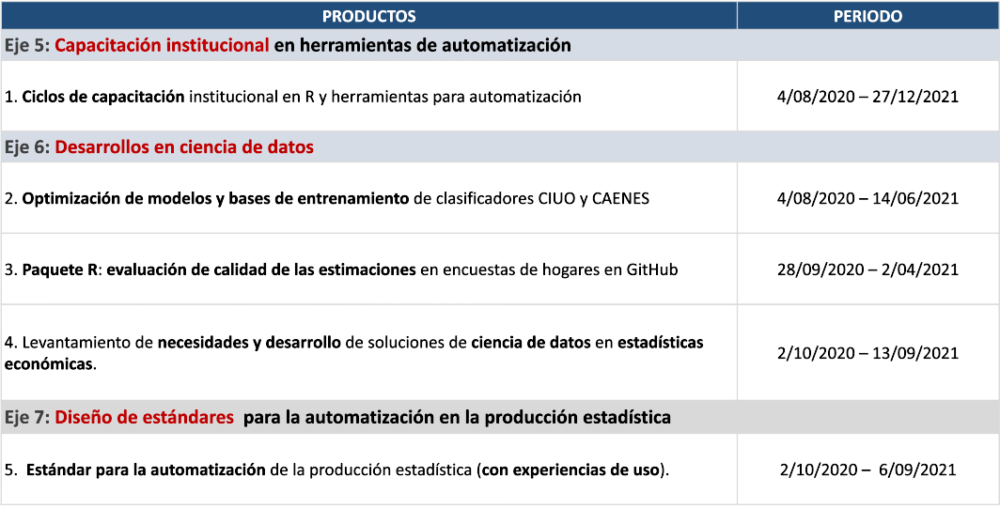
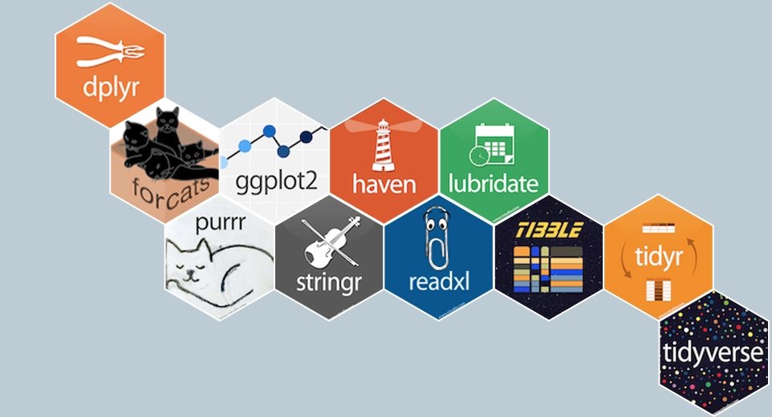

class: center, middle

.linea-superior[]
.linea-inferior[]


## Introducción a R

## Proyecto Estratégico Servicios Compartidos para la Producción Estadística

### Noviembre 2020


```{r setup, include=FALSE}
options(htmltools.dir.version = FALSE)
knitr::opts_chunk$set(message = FALSE) 
```

```{r xaringan-themer, include=FALSE, warning=FALSE}
library(xaringanthemer)
#style_duo_accent(
 # primary_color = "#1381B0",
  #secondary_color = "#FF961C",
  #inverse_header_color = "#FFFFFF"
#)
```


---
background-image: url("imagenes/fondo2.PNG")
background-size: contain;
background-position: 100% 0%

# Objetivos de la presentación

<br>
<br>

--

.center[
## Ofrecer contexto sobre la relevancia que ha cobrado `R` en la institución
]

--

.center[
## Mostrar las principales funcionalidades de `R`
]

--

.center[

## Entregar algunas herramientas prácticas para la instalación de algunos componentes
]

--

.center[

## Entregar algunas herramientas prácticas para la administración de RStudio Server
]

---

background-image: url("imagenes/fondo2.PNG")
background-size: contain;
background-position: 100% 0%

# Contenidos de la presentación

--
<br/>

- Presentación general del .pur[Proyecto Estratégico Servicios Compartidos para la Producción Estadística]

--

- Descripción general del lenguaje

--

- Presentación del IDE

--

- Manejo de paquetes

--

- Interacción con bases de datos

--

- Aplicaciones en html

--

- Interacción con otros lenguajes (python, SQL)

--

- Funciones para chequear hardware

--

- Administración de RStudio Server en Centos 7

---
background-image: url("imagenes/fondo2.PNG")
background-size: contain;
background-position: 100% 0%

# PE Servicios Compartidos

--

<br/>
<br/>

.center[.medium-par[**Objetivo del proyecto**:]]

.center[.medium-par[Proveer a la institución de estándares y desarrollos que permitan .medium-par-red[automatizar], .medium-par-red[estandarizar], .medium-par-red[ordenar] e .medium-par-red[innovar] en la producción estadística, permitiendo reducir .medium-par-red[tiempos] y .medium-par-red[costos] del procesamiento y análisis de las diferentes operaciones estadísticas del INE y minimizando la probabilidad de .medium-par-red[errores] en la publicación de resultados.]]

---
background-image: url("imagenes/fondo2.PNG")
background-size: contain;
background-position: 100% 0%

# PE SSCC - Estructura del proyecto

--
.center[

]

---
background-image: url("imagenes/fondo2.PNG")
background-size: contain;
background-position: 100% 0%

# PE SSCC - Planificación 2020-2021

--
<br/>
<br/>

.center[

]

---
background-image: url("imagenes/fondo2.PNG")
background-size: contain;
background-position: 100% 0%

# R, Autimatización y Ciencia de datos

--
<br/>
<br/>

.center[
.medium-par[쮸lguna/o de ustedes tiene experiencia con `R`?]
]

--

.center[
.medium-par[쮸lguna/o de ustedes tiene experiencia o interrés en .pur[ciencia de datos]?]
]

--

.center[
.medium-par[Quienes hacen desarrollo, 쯤ué .pur[lenguajes] utilizan?]
]

--

.center[
.big-par[🤔]
]

---
background-image: url("imagenes/fondo2.PNG")
background-size: contain;
background-position: 100% 0%

# Panorama institucional

Durante los últimos años, las herramientas más comunmente utilizadas en la SDT han sido STATA y SAS.

.pull-left[


]

.pull-right[


]


--

Existe un impulso para que los procesamientos migren a `R`.

--

La competencia natural de R dentro de la institución es STATA.

--

- Ambos permiten llevar a cabo el procesamiento estadístico.

- Stata es muy popular entre de los economistas.

--

Pero...

--

- R es gratuito.

- Permite abordar una variedad de tareas mucho más amplia que STATA.

---

background-image: url("imagenes/fondo2.PNG")
background-size: contain;
background-position: 100% 0%

# Panorama institucional


### Python podría ser una buena alternativa 

.center[

]


También es gratuito.

--

Es un lenguaje .pur[multiparadigma] que podría ser .pur[compartido por SDT y SDTI].

--

Pero su uso es aún muy incipiente en la SDT.  


---
background-image: url("imagenes/fondo2.PNG")
background-size: contain;
background-position: 100% 0%

# Descripción del lenguaje

`R` es un lenguaje de libre distribución y de código abierto, disponible para *Linux, Windows y MacOS*


.center[


]


--

Tanto R como RStudio (IDE) son gratuitos.

--

.pull-left[

]

.pull-right[


]


--

La primera versión de `R` fue liberada en 1993 y constantemente aparecen actualizaciones (versión actual 4.0.3). 

--

`R` es un .pur[lenguaje interpretado de alto nivel], que utiliza por detrás código de C, C++ y Fortran.

---
background-image: url("imagenes/fondo2.PNG")
background-size: contain;
background-position: 100% 0%

# Descripción del lenguaje

--

`R` fue diseñado por estadísticos y para estadísticos.

--

Con el tiempo su uso se ha ido extendiendo a otras áreas: medicina, ciencia política, ingeniería, ciencias sociales, ecología, entre otros.

--

.center[


]


---

background-image: url("imagenes/fondo2.PNG")
background-size: contain;
background-position: 100% 0%

# Descripción del lenguaje

--

Actualmente, es un lenguaje muy popular en el mundo académico y está tomando fuerza en el sector público. 


.center[


]


--

### Compite con Python en el campo de la ciencia de datos.

---
background-image: url("imagenes/fondo2.PNG")
background-size: contain;
background-position: 100% 0%

# RStudio

--

### Antes de seguir, echemos un vistazo al entorno de desarrollo 

--

R puede funcionar con distintos IDEs (Eclipse, Visual Studio, R-Brain).

--

El más popular es `RStudio`

--

.center[


]

---
background-image: url("imagenes/fondo2.PNG")
background-size: contain;
background-position: 100% 0%

# Paquetes (librerías) en R 

--

La comunidad de R colabora activamente en el desarrollo de paquetes.

--

CRAN (*Comprehensive R Archive Network*) es el repositorio donde se almacenan los paquetes "oficiales".

--

Actualmente en CRAN hay más de 10.000 paquetes disponibles.

--

Entrar a CRAN requiere cumplir con ciertos estándares de calidad.


--

.red[La configuración de proxy del INE impide descargar paquetes de CRAN] 

.red[Es necesario desactivar una función en RStudio] 


---
background-image: url("imagenes/fondo2.PNG")
background-size: contain;
background-position: 100% 0%

# Paquetes (librerías) en R

.center[


]

---
background-image: url("imagenes/fondo2.PNG")
background-size: contain;
background-position: 100% 0%

# Paquetes (librerías) en R

--

Muchos usuarios suben sus paquetes a github o gitlab.

.center[


]

--

Esta es una manera rápida y fácil de compartir un desarrollo.

--

Muchos paquetes de gran utilidad no están en CRAN.

--

En este momento, no es posible descargar paquetes de github debido al bloqueo institucional.

--

Existe actualmente un bloqueo todos los sitios con denominación "nube de almacenamiento".

--

.pull-left[
Esto impide, por ejemplo, descargar un [paquete](https://github.com/michael-cw/SurveySolutionsAPI) que el Banco Mundial ofrece para interactuar con la API de Survey Solutions.  
]

.pull-right[


]

---

background-image: url("imagenes/fondo2.PNG")
background-size: contain;
background-position: 100% 0%

# Plataformas git en procesamiento 

--
<br/>

En el marco del PE SSCC se está estudiando la .pur[implementación de plataformas git para el procesamiento y análisis de datos].

--

Esta es una iniciativa incipiente, por lo que se está evaluando a través de .pur[experiencias de uso].

--

La primera experiencia a evaluar es el uso de .pur[Gitlab] en la .pur[prueba piloto de la IX EPF].

--

El .pur[desafío] es imprimir estas .pur[herramientas] y .pur[flujos de trabajo colaborativo] en equipos .pur[no informáticos].

--

.center[.medium-par[`R` facilita la vinculación con plataformas git a través de su interfaz gráfica.]]
---

background-image: url("imagenes/fondo2.PNG")
background-size: contain;
background-position: 100% 0%

# Instalación de paquetes 

--

Paquetes que están en CRAN.

```{r, eval=FALSE}
install.packages("tidyverse")
```

--

```{r, eval=FALSE}
library(tidyverse)
```

--

Paquetes fuera de CRAN.

```{r, eval=FALSE}
library(devtools)
install_github("Klauslehmann/calidad")
```


[Ejemplo paquete en github](https://github.com/Klauslehmann/calidad)

---

background-image: url("imagenes/fondo2.PNG")
background-size: contain;
background-position: 100% 0%

# Instalación de paquetes 

--

Instalación de versiones anteriores de un paquete.

```{r, eval=FALSE}
devtools::install_version("ggplot2", version = "0.9.1", repos = "http://cran.us.r-project.org")

```

--

Para instalar paquetes precompilados.

```{r, eval=FALSE}
install.binaries("ggplot2")
```


---

background-image: url("imagenes/fondo2.PNG")
background-size: contain;
background-position: 100% 0%

# R para bases de datos 

--

Existen varios paquetes para trabajar con bases de datos.

--

- `DBI`

- `RODBC`

- `dbConnect`

- `RSQLite`

- `RMySQL`

- `RPostgreSQL`

--

Para hacer la conexión, la opción más sencilla es autenticar mediante la cuenta institucional.

--

```{r, eval=FALSE}
con <- odbcDriverConnect('driver={SQL Server};server=BUVMSQLWINP01\\EXPLOT;database=ENE_ZERO;trusted_connection=true<encoding = latin1')
```


---
background-image: url("imagenes/fondo2.PNG")
background-size: contain;
background-position: 100% 0%

# R para bases de datos

--

Establecer la conexión desde una máquina Linux no permite autenticar con las credenciales institucionales.

--

Se genera un problema cuando queremos trabajar desde el RServer (CentOS).

--

En estos casos, accedemos mediante un usuario creado en la base de datos.

```{r, eval=FALSE}
library(RODBC)
con <- odbcDriverConnect('driver=ODBC Driver 11 for SQL Server;server=buvmsqlwinp04\\RRAA,58550;database=SUPERINTENDENCIA_2; uid=****; pwd=*******')

```

--

Podemos consultar la base de datos usando directamente código de SQL.


```{r, eval=FALSE}
query = sqlQuery(con, 'SELECT TOP 10 * FROM SUPERINTENDENCIA_2.dbo.COTIZACIONES_TRAB_A02') 
```

---

background-image: url("imagenes/fondo2.PNG")
background-size: contain;
background-position: 100% 0%

# R para bases de datos 

También es posible hacer consultas con código de `R`, mediante `dbplyr`.

--

```{r, eval=FALSE}
library(dbplyr)
con <- DBI::dbConnect(RSQLite::SQLite(), "driver=ODBC Driver 11 for SQL Server;server=buvmsqlwinp04\\RRAA,58550;database=SUPERINTENDENCIA_2; uid=****; pwd=*******")

copy_to(con, query, "query2")
query2 <- tbl(con, "query2")

media <- query2 %>% #<<
  group_by(anio) %>% #<< 
  summarise(media = mean(ID_trabajor, na.rm = TRUE)) %>% #<<
  select(media) #<<

media %>% 
  collect()


```

--

El paquete `dbplyr` traduce la sintaxis de `dplyr` a SQL.

--

.pull-left[

### 쯈ué es dplyr?


]


.pull-right[

]


---
background-image: url("imagenes/fondo2.PNG")
background-size: contain;
background-position: 100% 0

# Un poco sobre dplyr y tidyverse

--

Durante los últimos años ha surgido un proyecto llamado **tidyverse**.

--

Es un conjunto de paquetes que comparten **una filosofía, una sintaxis y una manera de hacer las cosas**.


.center[

]

---
background-image: url("imagenes/fondo2.PNG")
background-size: contain;
background-position: 100% 0

# Un poco sobre dplyr y tidyverse

--

Aunque no existe una única forma de hacer las cosas, es útil llegar a consensos, en aras de mejorar la comunicación.

--

`tidyverse` nos provee de una gran cantidad de herramientas para tener un lenguaje común.

--

Desde Servicios Compartidos estamos promoviendo el uso de tidyverse para el procesamiento estadístico.   


--

El paquete `dplyr` es el corazón de `tidyverse` y la principal herramienta para la manipulación de datos.


.pull-left[

]

.pull-right[
### dplyr es nuestro caballito de batalla en las capacitaciones
]


---
background-image: url("imagenes/fondo2.PNG")
background-size: contain;
background-position: 100% 0%

# R y html

--

Existen múltiples herramientas para generar archivos html.

--

Esta presentación es un archivo html generado con un paquete llamado `rmarkdown`.

--

```{html, eval = F}
<script>
slideshow._releaseMath = function(el) {
  var i, text, code, codes = el.getElementsByTagName('code');
  for (i = 0; i < codes.length;) {
    code = codes[i];
    if (code.parentNode.tagName !== 'PRE' && code.childElementCount === 0) {
      text = code.textContent;
      if (/^\\\((.|\s)+\\\)$/.test(text) || /^\\\[(.|\s)+\\\]$/.test(text) ||
          /^\$\$(.|\s)+\$\$$/.test(text) ||
          /^\\begin\{([^}]+)\}(.|\s)+\\end\{[^}]+\}$/.test(text)) {
        code.outerHTML = code.innerHTML;  // remove <code></code>
        continue;
      }
    }
    i++;
  }
};
slideshow._releaseMath(document);
</script>

```

---
background-image: url("imagenes/fondo2.PNG")
background-size: contain;
background-position: 100% 0%

# rmarkdown 

--
<br/>

Es un paquete que está siendo utilizado de manera intensiva en la SDT para generar reportes 

--

Permite generar archivos html y pdf

--

La modalidad pdf soporta código de latex.

--

Dado que `rmarkdown` permite incluir texto plano y código en R, es ideal para incorporar sistemas automáticos de reportería.

--

[Documento de trabajo](https://www.ine.cl/docs/default-source/documentos-de-trabajo/c%C3%A1lculo-de-medidas-de-precisi%C3%B3n-para-medianas-de-ingreso-y-gasto-de-la-v.pdf?sfvrsn=e5b6a7b3_2) en pdf generado con `rmarkdown`.

--

Para la generación de reportes automáticos que se han multiplicado ultimamente se está utilizando `rmarkdown` en combinación con un paquete llamado `Sweave`.

--

Se han automatizado en el INE con estas herramientas el **EMAT**, **ISUP**, **IPP**, entre otros, y se está trabajando en la automatización de los boletines de la **ENE**.

--

Se ha generado un ahorro importante de tiempo de trabajo manual.

---
background-image: url("imagenes/fondo2.PNG")
background-size: contain;
background-position: 100% 0%

# R y html 

bookdown es otro paquete para generar archivos html

--

El objetivo es generar un libro en formato digital

--

[R for data science](https://r4ds.had.co.nz/) 

--

El manual de trabajo de campo de la prueba piloto EPF fue generado mediante bookdown


---
background-image: url("imagenes/fondo2.PNG")
background-size: contain;
background-position: 100% 0%

# R y shiny 

--

`shiny` permite crear aplicaciones web mediante código de R

--

El paquete permite generar un archivo html que contiene javascript y css. 

--

Se estructura a partir de 2 funciones principales:

- ui: interfaz de usuario 

- server: procesa los datos 


[Ejemplo EPF](https://klaus-lehmann.shinyapps.io/epf-app/?_ga=2.227155677.1937938277.1605228598-1258237829.1596836306)

---

background-image: url("imagenes/fondo2.PNG")
background-size: contain;
background-position: 100% 0%


# Visualizaciones con R 

--

Es posible generar visualizaciones animadas

--

```{r, echo=F, fig.align='center', warning=F, message=F}
library(gganimate)
p <- ggplot(gapminder::gapminder, aes(gdpPercap, lifeExp, 
                           color = continent)) +
  geom_point(aes(size = pop), show.legend = FALSE) +
  scale_y_continuous(breaks = seq(20,90,10)) +
  scale_size(range = c(2,12)) + 
  scale_x_log10() +
  transition_states(year) + #<< 
  labs(title = 'Año: {closest_state}', x = 'pib p/c', y = 'esperanza de vida') + #<<
  theme(plot.title = element_text(hjust = 0.5))

animate(p, renderer = gifski_renderer(), fps=10)


```

---

background-image: url("imagenes/fondo2.PNG")
background-size: contain;
background-position: 100% 0%

# Visualizaciones con R 

--

Podemos usar de manera sencilla código de javascript para generar visualizaciones más atractivas 

[Ejemplo EPF](https://klauslehmann.netlify.app/2019/07/07/en-qu%C3%A9-gastan-los-hogares-chilenos/) 

--

Como pueden ver, `R` está acercando herramientas de visualización a los analistas técnicos, permitiéndoles .pur[desarrollar sus propias visualizaciones sin necesidad de edición para llegar al usuacio final].

--

Actualmente existe una **mesa de trabajo entre SDT y SDTI (difusión)** para lograr embeber/implementar visualizaciones en la web institucional.

---

background-image: url("imagenes/fondo2.PNG")
background-size: contain;
background-position: 100% 0%

# Integración con otros lenguajes

Ya hemos visto que podemos usar código de SQL sin mayores problemas

--

Mediante el paquete `reticulate` es posible cargar el intérprete de python y generar flujos de trabajo integrados de python y R


.center[]

--

En Servicios Compartidos estamos incorporando un flujo de procesamiento que contiene código de python y R

---

background-image: url("imagenes/fondo2.PNG")
background-size: contain;
background-position: 100% 0%

# Integración con otros lenguajes

El paquete `Rcpp` permite usar código de C++


--

Podemos usar C++, para crear funciones de R más eficientes 

--

Última alternativa cuando las funciones existentes no son suficientmente veloces

---

background-image: url("imagenes/fondo2.PNG")
background-size: contain;
background-position: 100% 0%


# Revisando el hardware

--

A veces, puede ser necesario revisar las características de una máquina y de R

--

Para mirar el número de CPUs

```{r}
library(parallel)
detectCores()

```

Para mirar la versión de R

```{r}
version
```

---

background-image: url("imagenes/fondo2.PNG")
background-size: contain;
background-position: 100% 0%

# Administración de RStudio Server en Centos 7


### esto es del último cómmit

---
Contenidos:
De la primera sesión de R en EPF (lenguaje interpretado, etc.)
Presentación del lenguaje R y de RStudio.
Interfaz de RStudio.
Gráfico lenguajes más populares Stockoverflow.
Usos de R (nicho de estadísticas y ciencia de datos)
Paquetes en R.
Instalación de paquetes
Cargar paquetes en la sesión
Paquetes en CRAN
Paquetes GitHub, Gitlab, Bitbucker.
Formas de cargar paquetes.
Panorama general de desarrollo de paquetes de R.
Interacción de R con bases de datos.
Mencionar dbplyr, sqlite.
Sentencias para evaluar funcionalidad desde R.
Chequear hardware (ram, número de procesadores)
Aplicaciones html
Características generales de shiny
plotly
Fecha tentativa clase:
Última semana de octubre

---

class: center, middle

.linea-superior[]
.linea-inferior[]


## Introducción a R

## Proyecto Estratégico Servicios Compartidos para la Producción Estadística

## 

### Noviembre 2020
